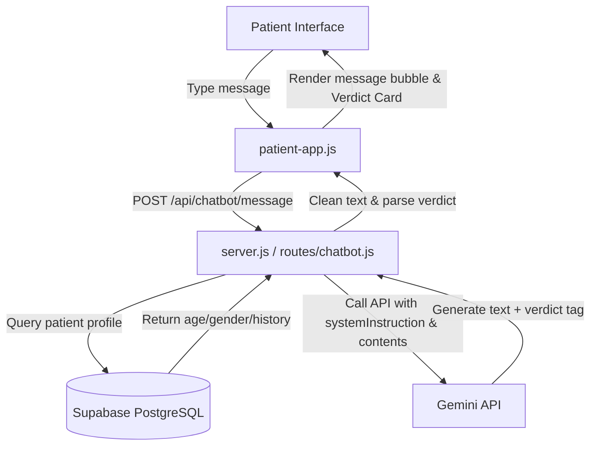

# RuralCare Connect — Full Project Report

## 🗂️ Project Location
All files live in: **`C:\project\`**

---

## 🛠️ Tools & Technologies Used

### Core Stack

| Layer | Tool | Why chosen |
|---|---|---|
| **Runtime** | Node.js | JavaScript on the server |
| **Framework** | Express.js | Lightweight REST API server |
| **Database** | PostgreSQL via **Supabase** | Managed cloud DB — persistent, free tier, live dashboard |
| **DB Client** | `pg` (node-postgres) | Raw SQL queries with an async connection pool |
| **Auth** | JWT (`jsonwebtoken`) + `bcryptjs` | Secure stateless tokens + hashed passwords |
| **File uploads** | `multer` | For procurement bill attachments |
| **Deployment** | Railway (backend) + Supabase (DB) | Railway hosts the Express server; Supabase stores all data |

### Why Supabase instead of SQLite?
> SQLite stores data in a local file (`ruralcare.db`). Railway's filesystem resets on every restart — so data was being lost. Supabase is a managed cloud PostgreSQL database that stores data **permanently** and is accessible from anywhere. It also comes with a live visual dashboard (Table Editor) to browse data like a spreadsheet.

---

## 📁 Complete File Map

```
C:\project\
│
├── index.html          ← Frontend UI (single HTML file, served by Express)
├── app.js              ← Frontend: auth + home/beds/medicines pages
├── app2.js             ← Frontend: hospital dashboard + resource update pages
├── app3.js             ← Frontend: shortage/audit/patients/district pages
│
├── server.js           ← Express server entry point (run this to start)
├── package.json        ← Node dependencies list
├── .env                ← Config: PORT, JWT_SECRET, DATABASE_URL
│
├── db/
│   ├── database.js     ← pg Pool wrapper (async get/all/run/transaction API)
│   ├── schema.sql      ← All 15 table CREATE statements (PostgreSQL syntax)
│   ├── init.js         ← Runs schema on Supabase at startup
│   └── seed.js         ← ✏️ EDITABLE demo data (hospitals, users, patients...)
│
├── middleware/
│   └── auth.js         ← JWT token verifier + role guard
│
├── routes/
│   ├── auth.js         ← POST /api/auth/login, /register, /logout, /me
│   ├── hospitals.js    ← Hospital resources, wards, thresholds, bed reservations
│   ├── patients.js     ← Patient records CRUD + visit history
│   ├── medicines.js    ← Medicine inventory + reservations
│   ├── shortages.js    ← Procurement requests + vendors
│   ├── emergency.js    ← SOS dispatch + hospital finder
│   ├── audit.js        ← Audit log + CSV export
│   └── district.js     ← Govt district overview + bulk dispatch
│
└── uploads/            ← Uploaded procurement bill files stored here
```

---

## 🗄️ Accessing the Database

### Option 1 — Supabase Dashboard (Recommended — No install needed)
> Go to: **[https://supabase.com](https://supabase.com)** → Sign in → Select `ruralcare-connect` project → **Table Editor**

You can:
- Browse all 15 tables visually (like a spreadsheet)
- Run SQL queries in the **SQL Editor** tab
- Edit data directly
- See real-time inserts/updates

### Option 2 — Command line (local)
```bash
# In C:\project terminal — query Supabase directly:
node -e "const db=require('./db/database'); db.all('SELECT name, beds_free FROM hospitals h JOIN hospital_resources r ON h.id=r.hospital_id').then(rows => { console.log(rows); process.exit(); })"
```

### The 15 Tables

| Table | What it stores |
|---|---|
| `users` | Login accounts (all 3 roles) |
| `hospitals` | Hospital master list (name, location, capacity) |
| `hospital_resources` | **Live** bed/ICU/O₂/doctor counts |
| `ward_status` | Per-ward bed occupancy |
| `resource_thresholds` | Alert trigger levels per resource |
| `patients` | Patient master records |
| `patient_conditions` | Conditions linked to patients |
| `patient_medications` | Active prescriptions |
| `patient_visits` | Visit history / timeline |
| `medicines` | Medicine inventory per hospital |
| `medicine_reservations` | Patient medicine reservations |
| `vendors` | Verified supply vendors |
| `shortage_requests` | Procurement requests |
| `emergency_calls` | SOS / emergency routing log |
| `audit_log` | Immutable action log (all changes) |
| `bed_reservations` | Patient bed reservation requests |

---

## ✏️ How to Edit Data

### Edit seed / demo data
Open `C:\project\db\seed.js` — edit any of the data arrays at the top of the file (HOSPITALS, USERS, PATIENTS, MEDICINES etc.), then:
```bash
# In C:\project terminal:
node db/seed.js --reset
```
This wipes Supabase and re-seeds everything fresh.

### Add a new user (e.g. new hospital admin)
Add to the `USERS` array in `db/seed.js`:
```js
{ login_id:'HOSP003', password:'mypassword', role:'hospital', name:'Dr. New Admin', hospital_id:3 }
```
Then run `node db/seed.js --reset`.

### Change passwords
Edit the `password` field in `USERS` inside `db/seed.js` and re-seed.
Passwords are automatically bcrypt-hashed on every seed.

### Change alert thresholds
Edit the `THRESHOLDS` array in `db/seed.js`, or use the **Hospital Admin → Update Resources → Threshold table** in the live UI.

---

## 🔌 All API Endpoints

| Method | Endpoint | Who can call |
|---|---|---|
| POST | `/api/auth/register` | Public (new patients) |
| POST | `/api/auth/login` | Everyone |
| POST | `/api/auth/logout` | Logged-in users |
| GET | `/api/auth/me` | Logged-in users |
| GET | `/api/hospitals` | All roles |
| GET | `/api/hospitals/:id` | All roles |
| PUT | `/api/hospitals/:id/resources` | Hospital Admin |
| GET | `/api/hospitals/:id/wards` | All roles |
| PUT | `/api/hospitals/:id/wards` | Hospital Admin |
| GET | `/api/hospitals/:id/thresholds` | Hospital Admin, Govt |
| PUT | `/api/hospitals/:id/thresholds` | Hospital Admin |
| POST | `/api/hospitals/:id/reserve-bed` | Patient |
| GET | `/api/hospitals/:id/bed-reservations` | Hospital Admin |
| PATCH | `/api/hospitals/:id/bed-reservations/:rid/status` | Hospital Admin |
| GET | `/api/patients` | Hospital Admin, Govt |
| GET | `/api/patients/me` | Patient (own record only) |
| GET | `/api/patients/:id` | Hospital Admin, Govt |
| POST | `/api/patients` | Hospital Admin |
| POST | `/api/patients/:id/visits` | Hospital Admin |
| PATCH | `/api/patients/:id/status` | Hospital Admin |
| GET | `/api/medicines` | All roles |
| GET | `/api/medicines/price-comparison` | All roles |
| GET | `/api/medicines/reservations` | Hospital Admin |
| PATCH | `/api/medicines/reservations/:id/status` | Hospital Admin |
| POST | `/api/medicines/:id/reserve` | Patient |
| PUT | `/api/medicines/:id` | Hospital Admin |
| POST | `/api/medicines` | Hospital Admin |
| GET | `/api/shortages` | Hospital Admin, Govt |
| POST | `/api/shortages` | Hospital Admin |
| PATCH | `/api/shortages/:id/status` | Govt, Hospital Admin |
| GET | `/api/shortages/vendors` | Hospital Admin, Govt |
| POST | `/api/emergency/sos` | Patient |
| POST | `/api/emergency/find-hospital` | Patient |
| GET | `/api/emergency/history` | Hospital Admin, Govt |
| GET | `/api/audit` | Hospital Admin, Govt |
| GET | `/api/audit/export` | Hospital Admin, Govt (returns CSV) |
| GET | `/api/district/overview` | Govt |
| GET | `/api/district/shortages` | Govt |
| POST | `/api/district/dispatch` | Govt |
| GET | `/api/district/reports` | Govt |
| GET | `/api/health` | Public (server health check) |

---

## 🚀 Running the App

```bash
# In C:\project — open a terminal and run:
node server.js

# Dev mode (auto-restart on file changes):
npm run dev

# App opens at:
http://localhost:3000
```

### Demo Logins
| Role | Login ID | Password |
|---|---|---|
| Patient | `9876543210` | `patient123` |
| Patient 2 | `9432111200` | `sunita123` |
| Hospital Admin | `HOSP001` | `hospital123` |
| Hospital Admin 2 | `HOSP002` | `hosp2pwd` |
| Govt / NHM | `GOVT001` | `govt123` |

### Live URL (Deployed)
> **[https://ruralcare-connect-production.up.railway.app](https://ruralcare-connect-production.up.railway.app)**

---

## 🔧 Config File (`.env`)

Located at `C:\project\.env`. Never commit this file to GitHub.

```
PORT=3000                        ← Change port here
JWT_SECRET=ruralcare_jwt_...     ← Change this in production!
JWT_EXPIRES_IN=24h               ← Token expiry
DATABASE_URL=postgresql://...    ← Supabase connection string (Transaction Pooler URL)
```

---

## ☁️ Deployment Architecture

```
User Browser
     │
     ▼
Railway (Express Server — server.js)
     │  runs node server.js
     │  reads DATABASE_URL from Railway environment variables
     │
     ▼
Supabase (PostgreSQL Cloud Database)
     │  stores all tables permanently
     │  accessible via Supabase Dashboard → Table Editor
```

### Railway Environment Variables Required
| Variable | Value |
|---|---|
| `PORT` | `3000` |
| `JWT_SECRET` | Your secret key |
| `JWT_EXPIRES_IN` | `24h` |
| `DATABASE_URL` | Supabase **Transaction Pooler** URL (port 6543) |

### How auto-deploy works
1. Push code to GitHub (`main` branch)
2. Railway detects the push automatically
3. Railway runs `npm install` then `node server.js`
4. Server connects to Supabase and checks if DB is empty
5. If empty → auto-seeds demo data and starts serving

---

## 📦 npm Packages Used

| Package | Version | Purpose |
|---|---|---|
| `express` | 4.x | Web server framework |
| `pg` | 8.x | PostgreSQL client (connects to Supabase) |
| `bcryptjs` | 2.x | Password hashing |
| `jsonwebtoken` | 9.x | JWT auth tokens |
| `cors` | 2.x | Cross-origin requests |
| `multer` | 1.x | File upload handling |
| `dotenv` | 16.x | Load `.env` config |
| `nodemon` | 3.x | Auto-restart during development (dev only) |

> Install all with: `npm install` (already done)
> Dev mode with auto-restart: `npm run dev`

---

## 🔮 Phase 2 — What's Simulated (Not Yet Real)

| Feature | Current state | Phase 2 |
|---|---|---|
| SMS notifications | `toast()` popup | Fast2SMS / Twilio API |
| Maps / GPS | Text-based location | Google Maps API |
| Real-time sync | Manual refresh | WebSockets / SSE |
| PDF export | `toast()` popup | Puppeteer / PDFKit |
| ABHA integration | Masked Aadhaar field | NHA Sandbox API |
| Supabase Auth | Custom JWT | Supabase Auth (email/phone login) |

---

## 📱 Phase 3 — Mobile Patient Portal (Added May 2026)

### What Was Built

A dedicated **mobile-first patient portal** accessible at `/patient`, giving patients a premium native-app experience.

### New Files Added

| File | Purpose |
|---|---|
| `patient.html` | Full mobile UI — HTML + CSS design system |
| `patient-app.js` | All JS — auth, API calls, tab rendering, service worker registration |
| `manifest.json` | PWA web app manifest (name, icons, theme, start URL) |
| `sw.js` | Service worker — offline caching + network-first API strategy |
| `icons/icon-192.png` | App icon 192×192 (for Android home screen) |
| `icons/icon-512.png` | App icon 512×512 (for splash screen / Play Store) |
| `.well-known/assetlinks.json` | Digital Asset Links — removes browser address bar in TWA APK |
| `generate-apk.ps1` | PowerShell script to call PWABuilder API and generate signed APK |

### Modified Files

| File | Change |
|---|---|
| `server.js` | Added `/patient` route, `/.well-known/assetlinks.json` route |
| `app.js` | `_afterAuth()` now routes patients to phone frame instead of desktop dashboard |
| `index.html` | Added phone frame CSS + HTML, `showPhoneFrame()` / `exitPhoneView()` functions, updated session restore logic |

---

### 🖥️ Phone Frame Feature (Desktop)

When a **patient logs in from a desktop browser** at `/`:
- Instead of the regular tab dashboard, they see a **realistic iPhone-style phone frame** centered on a dark teal background
- Inside the frame: an `<iframe>` loads `/patient`
- Same-origin `localStorage` → session auto-restores → no second login needed
- A **"← Switch Role / Sign Out"** button returns to the role picker

When a patient opens the site on an **actual mobile phone** (≤ 768px):
- Automatically redirected to `/patient` full-screen (no frame)

Hospital Admin and Govt Officer roles are **completely unchanged**.

---

### 📱 5-Tab Mobile Portal Features

| Tab | Features |
|---|---|
| 🏠 **Home** | Personalized greeting, live stat grid (hospitals, beds, alerts), 4 quick-action cards |
| 🏥 **Hospitals** | Live hospital cards with beds/ICU/O₂/doctors, call button, bed reservation bottom sheet |
| 💊 **Medicines** | Search with debounce, stock bars, reserve/notify buttons |
| 🚨 **Emergency** | Full-width pulsing SOS button, find-best-hospital form, 108/104/KDH quick dial |
| 📄 **My Records** | Profile card, conditions chips, active medications, visit history timeline |

### UI/UX Highlights
- Google Font: **Outfit** — modern and highly legible
- Fixed bottom navigation with glowing red SOS button in center
- Bottom sheet modal for bed reservation (slides up natively)
- Skeleton loading states while fetching data
- Toast notifications centered above bottom nav
- Safe area support for iPhone notch/home bar
- Dark teal gradient design system (`#0d4f47` → `#0f766e`)

---

### 📲 Android APK

A **signed Android APK** was generated using the PWABuilder REST API:

```
C:\project\ruralcare-signed\
  ├── RuralCare Connect.apk   ← Sideload on any Android phone
  ├── RuralCare Connect.aab   ← Upload to Google Play Store
  ├── signing.keystore         ← Keep this for future APK updates
  └── signing-key-info.txt
```

**APK type:** TWA (Trusted Web Activity) — wraps the Railway URL in a native Android shell

**To regenerate the APK** (e.g. after major UI changes):
```powershell
Set-ExecutionPolicy -Scope Process -ExecutionPolicy Bypass
powershell -File "c:\project\generate-apk.ps1"
```
Then extract `ruralcare-signed.apk.zip`.

**To install on Android:**
1. Transfer `RuralCare Connect.apk` to phone (WhatsApp / Google Drive / USB)
2. Settings → Security → Allow unknown sources
3. Tap APK → Install

**Address bar fix:** The `/.well-known/assetlinks.json` file links the APK's signing certificate (`SHA-256: 44:8B:E0:...`) to the Railway domain — this tells Chrome to hide the address bar and show full-screen.

---

### 🔌 How It All Connects

```
Android APK (TWA)
      ↓ opens
Railway HTTPS (https://ruralcare-connect-production.up.railway.app/patient)
      ↓ served by
Node.js Express (server.js) — running on Railway
      ↓ queries
Supabase PostgreSQL — cloud database on AWS Tokyo
```

---

### 📊 Capacity

| Usage | Concurrent Users |
|---|---|
| Browsing / loading pages | ~300–500 |
| Active API usage | ~50–100 |
| **Practical sweet spot** | **~50 users** |

> Sufficient for a rural block pilot. Upgrade Railway plan ($5–20/mo) to scale up.

---

## 🤖 Phase 4 — MediBot AI Symptom Chatbot (Added May 2026)

### Overview
MediBot is an intelligent, first-level symptom triage chatbot integrated directly into the patient portal. It allows patients to describe their symptoms in plain language, asks a few targeted follow-up questions, and outputs an actionable medical verdict linked directly to the application's native features.

### Core Features

1. **Supabase Patient Context Integration**
   Before initiating the conversation, MediBot queries the database securely for the patient's age, gender, active medications, and chronic conditions. It passes this context privately in the system instructions so Gemini can perform personalized risk assessments (e.g., classifying chest pain in an elderly diabetic patient as an immediate emergency).

2. **Advanced Multi-Turn Gemini Integration**
   Uses `gemini-flash-latest` (powered by Google's production-grade Gemini models) for fast, stable, and cost-effective multi-turn chat conversations. It is capped at 1,500 requests/day per key under the free tier, preventing server quota failures.

3. **Dedicated System Instructions**
   Passed via the modern `systemInstruction` API payload (instead of prepended text) to enforce strict, safe, and concise guidelines:
   - Max 3–4 sentences per response
   - Simple, neighborly, jargon-free English
   - Non-diagnostic triage (deciding severity, not making final diagnoses)
   - Asking 2–3 targeted follow-up questions first

4. **Actionable Verdict Cards**
   Once enough information is gathered, the bot generates a standard verdict tag which the frontend parses and displays as a visually premium alert card with built-in action buttons:

| Verdict Tag | UI Card Type | Action Triggered |
|---|---|---|
| `[VERDICT:NORMAL]` | Green (Success) | Reassurance & self-care instructions; Start New Chat button. |
| `[VERDICT:MEDICINE:Name]` | Blue (Info) | Link to search and reserve the suggested OTC medicine in the local pharmacy. |
| `[VERDICT:DOCTOR]` | Yellow (Warning) | Quick navigation to find and reserve a bed at the nearest hospital. |
| `[VERDICT:EMERGENCY]` | Pulsing Red (Danger) | Immediate click-to-call 108 Ambulance and direct GPS-enabled SOS dispatch trigger. |

### Technical Architecture & Code Flow



### Cache-Busting Strategy
To bypass the aggressive **cache-first** policy of the PWA Service Worker (`sw.js`) and ensure all client devices receive the new MediBot features instantly without needing manual storage clears or hard reloads, we implemented:
- **Script Query Versioning**: Version parameter appended to script path (`<script src="/patient-app.js?v=4"></script>`).
- **Cache Registry Update**: Incremented Service Worker cache version to `'ruralcare-v4'` and updated precache file path.
- **Dynamic Event Binding**: Moved the keydown event listener inside `patient-app.js` to pure JavaScript (`addEventListener`) to bypass browser HTML attribute parsing edge cases.

---

## 🔑 Login Credentials (All Roles)

| Role | Login ID | Password |
|---|---|---|
| 👤 Patient | `9876543210` | `patient123` |
| 🏥 Hospital Admin | `HOSP001` | `hospital123` |
| 🏛️ Govt Officer | `GOVT001` | `govt123` |

## 🌐 Live URLs

| URL | What it serves |
|---|---|
| `https://ruralcare-connect-production.up.railway.app/` | Main login (all roles) |
| `https://ruralcare-connect-production.up.railway.app/patient` | Mobile patient portal (direct) |
| `https://ruralcare-connect-production.up.railway.app/manifest.json` | PWA manifest |
| `https://ruralcare-connect-production.up.railway.app/.well-known/assetlinks.json` | Digital Asset Links |
